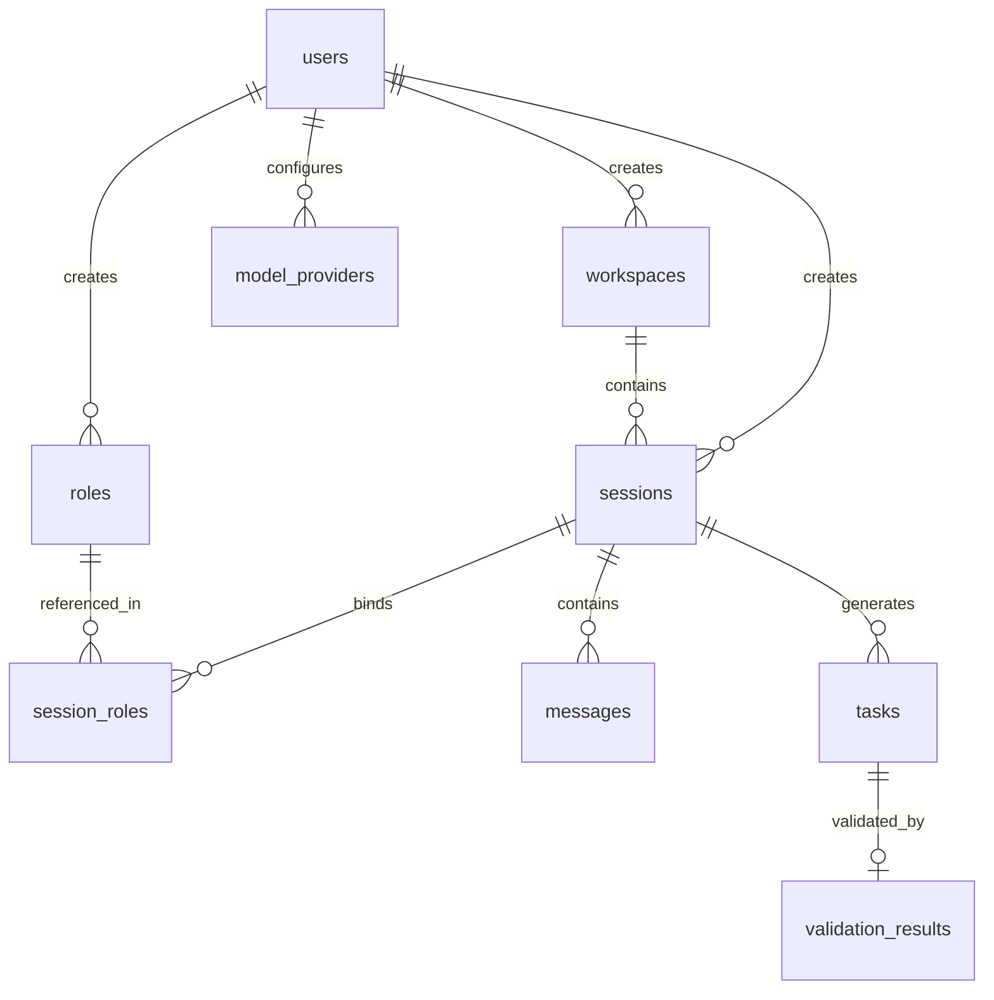

# 多模型协作系统 —— 数据库设计说明书

## 1. 引言

### 1.1 编写目的

本文档为「多模型圆桌会议系统」的数据库设计说明书，定义**数据库环境、ER 模型、表结构、索引策略、数据字典、访问模式、迁移方案**等，作为数据库开发、运维和数据管理的依据。

### 1.2 适用范围

本文档面向后端开发工程师、DBA 和运维人员。

### 1.3 术语

| 术语 | 说明 |
|------|------|
| DDL | 数据定义语言（CREATE/ALTER/DROP） |
| DML | 数据操作语言（INSERT/UPDATE/DELETE） |
| GIN 索引 | PostgreSQL Generalized Inverted Index，用于数组/JSON 类型 |
| pgvector | PostgreSQL 向量扩展，用于存储和检索 Embedding |
| TIMESTAMPTZ | 带时区的时间戳类型 |
| BIGSERIAL | 自增 64 位整数 |

---

## 2. 数据库环境

| 项目 | 规格 |
|------|------|
| 数据库系统 | PostgreSQL 16+ |
| 扩展 | `pgvector`（向量检索） |
| 字符集 | UTF-8 (UTF8) |
| 排序规则 | `en_US.UTF-8` |
| 存储引擎 | PostgreSQL 堆存储 |
| 连接池 | 应用层：pgxpool（max 50） |
| 备份策略 | pg_dump 每日全量 + WAL 归档持续归档 |
| 高可用 | Patroni + Primary/Standby 异步流复制 |

---

## 3. ER 图

### 3.1 实体关系总图

```
  ┌─────────┐     1:N     ┌─────────────┐
  │  users  │────────────→│ workspaces  │
  └─────────┘             └──────┬──────┘
       │                         │
       │                         │ 1:N
       │ 1:N                     ▼
       ├──────────────────┌──────────────┐
       │                  │  sessions    │
       │ 1:N              └──────┬───────┘
       ▼                         │
  ┌──────────┐             1:N  │     1:N
  │  roles   │◄──────────────────┤         │
  │(全局模板) │                  │         │
  └──────────┘                  │         │
       ▲                        │         │
       │ 1:N                    │ 1:N     │ 1:N
       │                        ▼         ▼
  ┌──────────────┐         ┌────────┐ ┌────────┐
  │session_roles │         │messages│ │ tasks  │
  └──────────────┘         └────────┘ └───┬────┘
                                          │
                                    1:N   │
                                          ▼
                                   ┌──────────────┐
                                   │valid_results │
                                   └──────────────┘

  ┌──────────────┐
  │model_provider│── N:1 ── users
  └──────────────┘
```

### 3.2 实体关系对照表

| 父实体 | 子实体 | 关系 | 外键 | 级联策略 |
|--------|--------|------|------|---------|
| users | workspaces | 1:N | creator_id | RESTRICT |
| users | roles | 1:N | creator_id | RESTRICT |
| users | sessions | 1:N | creator_id | RESTRICT |
| users | model_providers | 1:N | user_id | RESTRICT |
| workspaces | sessions | 1:N | workspace_id | CASCADE |
| sessions | session_roles | 1:N | session_id | CASCADE |
| sessions | messages | 1:N | session_id | CASCADE |
| sessions | tasks | 1:N | session_id | RESTRICT |
| roles | session_roles | 1:N | role_id | RESTRICT |
| tasks | validation_results | 1:1 | task_id | CASCADE |

---

## 4. 表结构

### 4.1 DDL

```sql
-- ============================
-- 文件名: 001_init.up.sql
-- 说明: 初始化数据库结构
-- ============================

-- 创建必要扩展
CREATE EXTENSION IF NOT EXISTS "pgcrypto";    -- gen_random_uuid()
CREATE EXTENSION IF NOT EXISTS "vector";       -- pgvector

-- ===== 1. 用户表 =====
CREATE TABLE users (
    id            VARCHAR(64) PRIMARY KEY,       -- 格式: u_xxx
    name          VARCHAR(128) NOT NULL,         -- 用户名
    email         VARCHAR(256) UNIQUE NOT NULL,  -- 邮箱 (登录凭证)
    password_hash VARCHAR(256) NOT NULL,         -- bcrypt 哈希
    avatar_url    VARCHAR(512),                  -- 头像 URL
    status        VARCHAR(32) NOT NULL DEFAULT 'active'
                  CHECK (status IN ('active', 'disabled')),
    created_at    TIMESTAMPTZ NOT NULL DEFAULT NOW(),
    updated_at    TIMESTAMPTZ NOT NULL DEFAULT NOW()
);
COMMENT ON TABLE users IS '系统用户表';
COMMENT ON COLUMN users.password_hash IS 'bcrypt(password + salt), 60 chars';

-- 索引
CREATE UNIQUE INDEX idx_users_email ON users(email)
    WHERE status = 'active';

-- ===== 2. 工作区表 =====
CREATE TABLE workspaces (
    id            VARCHAR(64) PRIMARY KEY,       -- 格式: ws_xxx
    name          VARCHAR(256) NOT NULL,         -- 工作区名称
    description   TEXT,                          -- 描述
    mode          VARCHAR(32) NOT NULL DEFAULT 'standalone'
                  CHECK (mode IN ('standalone', 'shared')),
    status        VARCHAR(32) NOT NULL DEFAULT 'active'
                  CHECK (status IN ('active', 'archived')),
    members       TEXT[] NOT NULL DEFAULT '{}',  -- 参与者 user_id 数组
    creator_id    VARCHAR(64) NOT NULL REFERENCES users(id),
    created_at    TIMESTAMPTZ NOT NULL DEFAULT NOW(),
    updated_at    TIMESTAMPTZ NOT NULL DEFAULT NOW()
);
COMMENT ON TABLE workspaces IS '工作区：多轮对话/多议题分区管理容器';
COMMENT ON COLUMN workspaces.mode IS 'standalone=独立模式(1:1), shared=共享模式(1:N)';
COMMENT ON COLUMN workspaces.members IS '参与者 ID 列表，用于权限校验和 UI 导航';

CREATE INDEX idx_workspaces_creator ON workspaces(creator_id);
CREATE INDEX idx_workspaces_members ON workspaces USING GIN(members);
CREATE INDEX idx_workspaces_status ON workspaces(status)
    WHERE status = 'active';

-- ===== 3. 角色表 =====
CREATE TABLE roles (
    id              VARCHAR(64) PRIMARY KEY,     -- 格式: r_xxx
    name            VARCHAR(128) NOT NULL,       -- 角色名 (如: 安全审查员)
    title           VARCHAR(128) NOT NULL,       -- 职位头衔
    traits          JSONB NOT NULL DEFAULT '{}'
                    CHECK (jsonb_typeof(traits) = 'object'),
    expertise       TEXT[] NOT NULL DEFAULT '{}',
    speaking_style  TEXT,                         -- 说话风格描述
    system_prompt   TEXT,                         -- 系统提示词模板
    skills          TEXT[] NOT NULL DEFAULT '{}',  -- 引用的 Skill 名称列表
    default_model   JSONB,                       -- {provider, model_name, parameters...}
    is_global       BOOLEAN NOT NULL DEFAULT false,
    creator_id      VARCHAR(64) REFERENCES users(id),
    created_at      TIMESTAMPTZ NOT NULL DEFAULT NOW(),
    updated_at      TIMESTAMPTZ NOT NULL DEFAULT NOW()
);
COMMENT ON TABLE roles IS 'AI 专家角色定义';
COMMENT ON COLUMN roles.traits IS '{
  "aggressiveness": 1-10,
  "optimism": 1-10,
  "creativity": 1-10,
  "detail": 1-10
}';
COMMENT ON COLUMN roles.skills IS '引用的 Skill 名称数组，内容自动注入 system_prompt';
COMMENT ON COLUMN roles.is_global IS 'true=系统预置全局模板, false=用户自建';

CREATE INDEX idx_roles_creator ON roles(creator_id);
CREATE INDEX idx_roles_global ON roles(is_global) WHERE is_global = true;
CREATE INDEX idx_roles_expertise ON roles USING GIN(expertise);
CREATE INDEX idx_roles_skills ON roles USING GIN(skills);

-- ===== 4. 会话表 =====
CREATE TABLE sessions (
    id              VARCHAR(64) PRIMARY KEY,     -- 格式: s_xxx
    workspace_id    VARCHAR(64) NOT NULL REFERENCES workspaces(id) ON DELETE CASCADE,
    title           VARCHAR(256) NOT NULL,
    paradigm        VARCHAR(64) NOT NULL
                    CHECK (paradigm IN ('round_robin', 'court', 'evaluation', 'free_chat')),
    status          VARCHAR(32) NOT NULL DEFAULT 'draft'
                    CHECK (status IN ('draft', 'running', 'paused', 'ended', 'failed')),
    max_rounds      INT NOT NULL DEFAULT 10
                    CHECK (max_rounds >= 1 AND max_rounds <= 100),
    round_timeout   INT NOT NULL DEFAULT 300
                    CHECK (round_timeout >= 30),
    config          JSONB NOT NULL DEFAULT '{}',
    creator_id      VARCHAR(64) NOT NULL REFERENCES users(id),
    created_at      TIMESTAMPTZ NOT NULL DEFAULT NOW(),
    updated_at      TIMESTAMPTZ NOT NULL DEFAULT NOW(),
    started_at      TIMESTAMPTZ,
    ended_at        TIMESTAMPTZ
);
COMMENT ON TABLE sessions IS '讨论会议会话';
COMMENT ON COLUMN sessions.paradigm IS '讨论范式: round_robin/court/evaluation/free_chat';
COMMENT ON COLUMN sessions.config IS '扩展配置 {context_enabled, auto_terminate, ...}';
COMMENT ON COLUMN sessions.started_at IS '首次 Start() 时间';
COMMENT ON COLUMN sessions.ended_at IS 'Terminate() 或自然结束时间';

CREATE INDEX idx_sessions_workspace ON sessions(workspace_id);
CREATE INDEX idx_sessions_creator ON sessions(creator_id);
CREATE INDEX idx_sessions_status ON sessions(status);
CREATE INDEX idx_sessions_workspace_status ON sessions(workspace_id, status);
CREATE INDEX idx_sessions_created_at ON sessions(created_at DESC);

-- ===== 5. 会话角色绑定表 =====
CREATE TABLE session_roles (
    id              VARCHAR(64) PRIMARY KEY,     -- 格式: sr_xxx
    session_id      VARCHAR(64) NOT NULL REFERENCES sessions(id) ON DELETE CASCADE,
    role_id         VARCHAR(64) NOT NULL REFERENCES roles(id),
    model_override  JSONB,                       -- 覆盖角色的默认模型 {provider, model_name, parameters}
    sort_order      INT NOT NULL DEFAULT 0,      -- 发言顺序
    UNIQUE(session_id, role_id)
);
COMMENT ON TABLE session_roles IS '会话与会话中使用的角色的关联表';
COMMENT ON COLUMN session_roles.model_override IS '可为该会话临时更换角色绑定的模型';

CREATE INDEX idx_session_roles_session ON session_roles(session_id);
CREATE INDEX idx_session_roles_role ON session_roles(role_id);

-- ===== 6. 消息表 =====
CREATE TABLE messages (
    id              VARCHAR(64) PRIMARY KEY,     -- 格式: msg_xxx
    session_id      VARCHAR(64) NOT NULL REFERENCES sessions(id) ON DELETE CASCADE,
    round_id        VARCHAR(64),                  -- 所属轮次 (可选)
    role_id         VARCHAR(64),                  -- 发言角色 ID
    author_type     VARCHAR(32) NOT NULL
                    CHECK (author_type IN ('ai', 'user', 'system')),
    role_name       VARCHAR(128),                -- 角色显示名 (冗余，便于查询)
    content         TEXT NOT NULL,
    tokens          INT NOT NULL DEFAULT 0
                    CHECK (tokens >= 0),
    metadata        JSONB NOT NULL DEFAULT '{}', -- {model, latency_ms, seq, phase}
    created_at      TIMESTAMPTZ NOT NULL DEFAULT NOW()
);
COMMENT ON TABLE messages IS '讨论消息记录（含流式 token 最终合并结果）';
COMMENT ON COLUMN messages.round_id IS '格式: round_{session_id}_{number}';
COMMENT ON COLUMN messages.role_name IS '冗余字段，避免频繁 JOIN roles 表';
COMMENT ON COLUMN messages.tokens IS '该消息消耗的 token 数，用于计费和上下文管理';

CREATE INDEX idx_messages_session ON messages(session_id);
CREATE INDEX idx_messages_session_round ON messages(session_id, round_id);
CREATE INDEX idx_messages_session_created ON messages(session_id, created_at);
CREATE INDEX idx_messages_author ON messages(session_id, author_type);

-- ===== 7. 任务表 =====
CREATE TABLE tasks (
    id                  VARCHAR(64) PRIMARY KEY, -- 格式: t_xxx
    session_id          VARCHAR(64) NOT NULL REFERENCES sessions(id),
    workspace_id        VARCHAR(64) NOT NULL REFERENCES workspaces(id),
    title               VARCHAR(256) NOT NULL,
    description         TEXT,
    acceptance_criteria TEXT,                    -- 验收标准
    status              VARCHAR(32) NOT NULL DEFAULT 'pending'
                        CHECK (status IN ('pending', 'in_progress', 'reviewing', 'completed', 'rejected')),
    priority            VARCHAR(16) NOT NULL DEFAULT 'medium'
                        CHECK (priority IN ('low', 'medium', 'high', 'critical')),
    assigned_agent      VARCHAR(64),             -- Agent ID
    assigned_by         VARCHAR(64) REFERENCES users(id),  -- "" 表示自动分配
    source_round        INT,                     -- 来源讨论轮次
    created_at          TIMESTAMPTZ NOT NULL DEFAULT NOW(),
    updated_at          TIMESTAMPTZ NOT NULL DEFAULT NOW(),
    completed_at        TIMESTAMPTZ
);
COMMENT ON TABLE tasks IS '从讨论结论中提取的可执行任务';
COMMENT ON COLUMN tasks.acceptance_criteria IS '验证官判定依据';
COMMENT ON COLUMN tasks.assigned_agent IS '执行 Agent 的 ID，null 表示待分配';

CREATE INDEX idx_tasks_session ON tasks(session_id);
CREATE INDEX idx_tasks_workspace ON tasks(workspace_id);
CREATE INDEX idx_tasks_status ON tasks(status);
CREATE INDEX idx_tasks_assignee ON tasks(assigned_agent);
CREATE INDEX idx_tasks_workspace_status ON tasks(workspace_id, status);
CREATE INDEX idx_tasks_priority ON tasks(priority) WHERE status = 'pending';

-- ===== 8. 验证结果表 =====
CREATE TABLE validation_results (
    id              VARCHAR(64) PRIMARY KEY,     -- 格式: vr_xxx
    task_id         VARCHAR(64) NOT NULL REFERENCES tasks(id) ON DELETE CASCADE,
    validator       VARCHAR(64) NOT NULL,        -- 验证官 Agent ID/名称
    verdict         VARCHAR(32) NOT NULL
                    CHECK (verdict IN ('passed', 'needs_revision', 'rejected')),
    reason          TEXT NOT NULL,                -- 判定理由
    detail          JSONB NOT NULL DEFAULT '{}', -- {checked_items: [{item, result, detail}], scores}
    created_at      TIMESTAMPTZ NOT NULL DEFAULT NOW(),
    UNIQUE(task_id)
);
COMMENT ON TABLE validation_results IS '验证官判定结果（每任务一条）';
COMMENT ON COLUMN validation_results.detail IS '逐项检查明细';

-- ===== 9. 模型配置表 =====
CREATE TABLE model_providers (
    id                  VARCHAR(64) PRIMARY KEY, -- 格式: mp_xxx
    user_id             VARCHAR(64) NOT NULL REFERENCES users(id),
    provider            VARCHAR(32) NOT NULL,    -- openai / anthropic / ollama / ark
    model_name          VARCHAR(128) NOT NULL,
    api_key_encrypted   TEXT,                    -- AES-256-GCM 加密
    base_url            VARCHAR(512),            -- 自定义 API 地址
    config              JSONB NOT NULL DEFAULT '{}'
                        CHECK (jsonb_typeof(config) = 'object'),
    is_active           BOOLEAN NOT NULL DEFAULT true,
    created_at          TIMESTAMPTZ NOT NULL DEFAULT NOW(),
    updated_at          TIMESTAMPTZ NOT NULL DEFAULT NOW(),
    UNIQUE(user_id, provider, model_name)
);
COMMENT ON TABLE model_providers IS '用户自行配置的模型 API 凭证';
COMMENT ON COLUMN model_providers.api_key_encrypted IS 'AES-256-GCM 加密后的 API Key';

CREATE INDEX idx_model_providers_user ON model_providers(user_id);
CREATE INDEX idx_model_providers_active ON model_providers(is_active)
    WHERE is_active = true;

-- ===== 10. 审计日志表 =====
CREATE TABLE audit_logs (
    id              BIGSERIAL PRIMARY KEY,
    session_id      VARCHAR(64),
    user_id         VARCHAR(64),
    event_type      VARCHAR(64) NOT NULL,        -- node_start / node_end / agent_call / error
    event_name      VARCHAR(256) NOT NULL,
    payload         JSONB NOT NULL DEFAULT '{}',  -- {input, output, latency, node_name, ...}
    created_at      TIMESTAMPTZ NOT NULL DEFAULT NOW()
);
COMMENT ON TABLE audit_logs IS '全链路审计日志，通过 Eino Callbacks 写入';
COMMENT ON COLUMN audit_logs.payload IS '事件详情，含输入输出快照';

CREATE INDEX idx_audit_session ON audit_logs(session_id);
CREATE INDEX idx_audit_user ON audit_logs(user_id);
CREATE INDEX idx_audit_type ON audit_logs(event_type);
CREATE INDEX idx_audit_created ON audit_logs(created_at DESC);
-- 按月分区 (可选，数据量大时启用)
-- CREATE TABLE audit_logs_y2026m01 PARTITION OF audit_logs
--     FOR VALUES FROM ('2026-01-01') TO ('2026-02-01');
```

### 4.2 回滚脚本

```sql
-- 文件名: 001_init.down.sql
DROP TABLE IF EXISTS audit_logs CASCADE;
DROP TABLE IF EXISTS validation_results CASCADE;
DROP TABLE IF EXISTS tasks CASCADE;
DROP TABLE IF EXISTS messages CASCADE;
DROP TABLE IF EXISTS session_roles CASCADE;
DROP TABLE IF EXISTS sessions CASCADE;
DROP TABLE IF EXISTS model_providers CASCADE;
DROP TABLE IF EXISTS roles CASCADE;
DROP TABLE IF EXISTS workspaces CASCADE;
DROP TABLE IF EXISTS users CASCADE;
```

---

## 5. 数据字典

### 5.1 字段级字典

| 表名 | 字段名 | 类型 | 必填 | 默认值 | 约束 | 说明 |
|------|--------|------|------|--------|------|------|
| users | id | VARCHAR(64) | Y | — | PK | 格式: `u_{ulid}` |
| users | name | VARCHAR(128) | Y | — | — | 显示名称 |
| users | email | VARCHAR(256) | Y | — | UNIQUE | 登录凭证 |
| users | password_hash | VARCHAR(256) | Y | — | — | bcrypt 输出 |
| users | avatar_url | VARCHAR(512) | N | NULL | — | 头像 |
| users | status | VARCHAR(32) | Y | 'active' | CK | active/disabled |
| users | created_at | TIMESTAMPTZ | Y | NOW() | — | — |
| users | updated_at | TIMESTAMPTZ | Y | NOW() | — | 自动更新 |
| workspaces | id | VARCHAR(64) | Y | — | PK | 格式: `ws_{ulid}` |
| workspaces | name | VARCHAR(256) | Y | — | — | — |
| workspaces | description | TEXT | N | NULL | — | — |
| workspaces | mode | VARCHAR(32) | Y | 'standalone' | CK | standalone/shared |
| workspaces | status | VARCHAR(32) | Y | 'active' | CK | active/archived |
| workspaces | members | TEXT[] | Y | '{}' | — | GIN 索引 |
| workspaces | creator_id | VARCHAR(64) | Y | — | FK→users | — |
| workspaces | created_at | TIMESTAMPTZ | Y | NOW() | — | — |
| workspaces | updated_at | TIMESTAMPTZ | Y | NOW() | — | — |
| roles | id | VARCHAR(64) | Y | — | PK | 格式: `r_{ulid}` |
| roles | name | VARCHAR(128) | Y | — | — | 如"安全审查员" |
| roles | title | VARCHAR(128) | Y | — | — | 职位头衔 |
| roles | traits | JSONB | Y | '{}' | CK | 四维特质 1-10 |
| roles | expertise | TEXT[] | Y | '{}' | — | 领域标签 |
| roles | speaking_style | TEXT | N | NULL | — | 说话风格描述 |
| roles | system_prompt | TEXT | N | NULL | — | 系统提示词 |
| roles | skills | TEXT[] | Y | '{}' | — | 引用的 Skill 名称，GIN 索引 |
| roles | default_model | JSONB | N | NULL | — | 默认模型绑定 |
| roles | is_global | BOOLEAN | Y | false | — | 系统模板标记 |
| roles | creator_id | VARCHAR(64) | N | NULL | FK→users | — |
| roles | created_at | TIMESTAMPTZ | Y | NOW() | — | — |
| roles | updated_at | TIMESTAMPTZ | Y | NOW() | — | — |
| sessions | id | VARCHAR(64) | Y | — | PK | 格式: `s_{ulid}` |
| sessions | workspace_id | VARCHAR(64) | Y | — | FK→workspaces | CASCADE 删除 |
| sessions | title | VARCHAR(256) | Y | — | — | 讨论标题 |
| sessions | paradigm | VARCHAR(64) | Y | — | CK | 可选四种范式 |
| sessions | status | VARCHAR(32) | Y | 'draft' | CK | 五态状态机 |
| sessions | max_rounds | INT | Y | 10 | CK 1-100 | — |
| sessions | round_timeout | INT | Y | 300 | CK ≥30 | 秒 |
| sessions | config | JSONB | Y | '{}' | — | 扩展配置 |
| sessions | creator_id | VARCHAR(64) | Y | — | FK→users | — |
| sessions | created_at | TIMESTAMPTZ | Y | NOW() | — | — |
| sessions | updated_at | TIMESTAMPTZ | Y | NOW() | — | — |
| sessions | started_at | TIMESTAMPTZ | N | NULL | — | — |
| sessions | ended_at | TIMESTAMPTZ | N | NULL | — | — |
| session_roles | id | VARCHAR(64) | Y | — | PK | 格式: `sr_{ulid}` |
| session_roles | session_id | VARCHAR(64) | Y | — | FK→sessions | CASCADE 删除 |
| session_roles | role_id | VARCHAR(64) | Y | — | FK→roles | — |
| session_roles | model_override | JSONB | N | NULL | — | 临时换模型 |
| session_roles | sort_order | INT | Y | 0 | — | 发言顺序 |
| messages | id | VARCHAR(64) | Y | — | PK | 格式: `msg_{ulid}` |
| messages | session_id | VARCHAR(64) | Y | — | FK→sessions | CASCADE 删除 |
| messages | round_id | VARCHAR(64) | N | NULL | — | 格式: round_{s_id}_{n} |
| messages | role_id | VARCHAR(64) | N | NULL | — | — |
| messages | author_type | VARCHAR(32) | Y | — | CK | ai/user/system |
| messages | role_name | VARCHAR(128) | N | NULL | — | 冗余 -->
| messages | content | TEXT | Y | — | — | 完整发言 |
| messages | tokens | INT | Y | 0 | CK ≥0 | 计费用 |
| messages | metadata | JSONB | Y | '{}' | — | 扩展信息 |
| messages | created_at | TIMESTAMPTZ | Y | NOW() | — | — |
| tasks | id | VARCHAR(64) | Y | — | PK | 格式: `t_{ulid}` |
| tasks | session_id | VARCHAR(64) | Y | — | FK→sessions | — |
| tasks | workspace_id | VARCHAR(64) | Y | — | FK→workspaces | 跨会话聚合 |
| tasks | title | VARCHAR(256) | Y | — | — | — |
| tasks | description | TEXT | N | NULL | — | — |
| tasks | acceptance_criteria | TEXT | N | NULL | — | — |
| tasks | status | VARCHAR(32) | Y | 'pending' | CK | 五态 |
| tasks | priority | VARCHAR(16) | Y | 'medium' | CK | 四级 |
| tasks | assigned_agent | VARCHAR(64) | N | NULL | — | Agent ID |
| tasks | assigned_by | VARCHAR(64) | N | NULL | FK→users | null=自动 |
| tasks | source_round | INT | N | NULL | — | — |
| tasks | created_at | TIMESTAMPTZ | Y | NOW() | — | — |
| tasks | updated_at | TIMESTAMPTZ | Y | NOW() | — | — |
| tasks | completed_at | TIMESTAMPTZ | N | NULL | — | — |
| validation_results | id | VARCHAR(64) | Y | — | PK | 格式: `vr_{ulid}` |
| validation_results | task_id | VARCHAR(64) | Y | — | FK→tasks, UNIQUE | CASCADE 删除 |
| validation_results | validator | VARCHAR(64) | Y | — | — | Agent ID |
| validation_results | verdict | VARCHAR(32) | Y | — | CK | passed/needs_revision/rejected |
| validation_results | reason | TEXT | Y | — | — | — |
| validation_results | detail | JSONB | Y | '{}' | — | 逐项明细 |
| validation_results | created_at | TIMESTAMPTZ | Y | NOW() | — | — |
| model_providers | id | VARCHAR(64) | Y | — | PK | 格式: `mp_{ulid}` |
| model_providers | user_id | VARCHAR(64) | Y | — | FK→users | — |
| model_providers | provider | VARCHAR(32) | Y | — | — | 提供商枚举 |
| model_providers | model_name | VARCHAR(128) | Y | — | — | 模型标识 |
| model_providers | api_key_encrypted | TEXT | N | NULL | — | AES-256-GCM |
| model_providers | base_url | VARCHAR(512) | N | NULL | — | 自定义地址 |
| model_providers | config | JSONB | Y | '{}' | CK | 参数配置 |
| model_providers | is_active | BOOLEAN | Y | true | — | — |
| model_providers | created_at | TIMESTAMPTZ | Y | NOW() | — | — |
| model_providers | updated_at | TIMESTAMPTZ | Y | NOW() | — | — |
| audit_logs | id | BIGSERIAL | Y | — | PK | 自增 |
| audit_logs | session_id | VARCHAR(64) | N | NULL | — | — |
| audit_logs | user_id | VARCHAR(64) | N | NULL | — | — |
| audit_logs | event_type | VARCHAR(64) | Y | — | — | 事件分类 |
| audit_logs | event_name | VARCHAR(256) | Y | — | — | 事件名称 |
| audit_logs | payload | JSONB | Y | '{}' | — | 详情 |
| audit_logs | created_at | TIMESTAMPTZ | Y | NOW() | — | — |

### 5.2 ENUM 对照表

| 字段 | 可选值 | 说明 |
|------|--------|------|
| workspaces.mode | `standalone`, `shared` | 独立/共享模式 |
| workspaces.status | `active`, `archived` | — |
| sessions.paradigm | `round_robin`, `court`, `evaluation`, `free_chat` | 四种讨论范式 |
| sessions.status | `draft`, `running`, `paused`, `ended`, `failed` | Session 状态 |
| messages.author_type | `ai`, `user`, `system` | 消息来源 |
| tasks.status | `pending`, `in_progress`, `reviewing`, `completed`, `rejected` | 任务状态 |
| tasks.priority | `low`, `medium`, `high`, `critical` | 任务优先级 |
| validation_results.verdict | `passed`, `needs_revision`, `rejected` | 验证结论 |
| model_providers.provider | `openai`, `anthropic`, `ollama`, `ark` | 模型提供商 |
| users.status | `active`, `disabled` | 用户状态 |

---

## 6. 索引策略

### 6.1 索引总览

| 索引名 | 表名 | 列 | 类型 | 唯一 | 条件 | 目的 |
|--------|------|-----|------|------|------|------|
| idx_users_email | users | email | BTREE | Y | WHERE active | 登录查询 |
| idx_workspaces_creator | workspaces | creator_id | BTREE | N | — | 用户工作区列表 |
| idx_workspaces_members | workspaces | members | GIN | N | — | 成员工作区列表 |
| idx_workspaces_status | workspaces | status | BTREE | N | WHERE active | 活跃工作区筛选 |
| idx_roles_creator | roles | creator_id | BTREE | N | — | 用户角色列表 |
| idx_roles_global | roles | is_global | BTREE | N | WHERE true | 全局模板 |
| idx_roles_expertise | roles | expertise | GIN | N | — | 标签搜索 |
| idx_sessions_workspace | sessions | workspace_id | BTREE | N | — | 工作区会话列表 |
| idx_sessions_workspace_status | sessions | workspace_id, status | BTREE | N | — | 按状态筛选 |
| idx_sessions_created_at | sessions | created_at | BTREE | N | DESC | 按时间排序 |
| idx_session_roles_session | session_roles | session_id | BTREE | N | — | 会话角色列表 |
| idx_session_roles_role | session_roles | role_id | BTREE | N | — | 角色使用统计 |
| idx_messages_session_round | messages | session_id, round_id | BTREE | N | — | 轮次消息查询 |
| idx_messages_author | messages | session_id, author_type | BTREE | N | — | 区分 AI/用户消息 |
| idx_tasks_workspace | tasks | workspace_id | BTREE | N | — | 工作区任务 |
| idx_tasks_workspace_status | tasks | workspace_id, status | BTREE | N | — | 任务面板筛选 |
| idx_tasks_priority | tasks | priority | BTREE | N | WHERE pending | 待办排序 |
| idx_audit_created | audit_logs | created_at | BTREE | N | DESC | 审计时间线 |

### 6.2 查询模式与索引使用

| 查询场景 | SQL | 使用的索引 |
|---------|-----|-----------|
| 用户登录 | `SELECT * FROM users WHERE email = $1 AND status = 'active'` | idx_users_email |
| 用户的工作区列表 | `SELECT * FROM workspaces WHERE $1 = ANY(members)` | idx_workspaces_members (GIN) |
| 工作区下的活跃会话 | `SELECT * FROM sessions WHERE workspace_id = $1 AND status = 'running'` | idx_sessions_workspace_status |
| 会话消息列表 | `SELECT * FROM messages WHERE session_id = $1 ORDER BY created_at` | idx_messages_session |
| 某轮次消息 | `SELECT * FROM messages WHERE session_id = $1 AND round_id = $2` | idx_messages_session_round |
| 工作区任务汇总 | `SELECT status, COUNT(*) FROM tasks WHERE workspace_id = $1 GROUP BY status` | idx_tasks_workspace (覆盖索引) |
| 待分配高优任务 | `SELECT * FROM tasks WHERE status = 'pending' ORDER BY priority DESC` | idx_tasks_priority |

---

## 7. 数据访问模式

### 7.1 核心查询路径

```go
// 1. 获取工作区及其活跃会话
func (r *WorkspaceRepo) GetWithActiveSessions(ctx context.Context, id string) (*Workspace, []*Session, error) {
    ws, err := r.Get(ctx, id)
    if err != nil {
        return nil, nil, err
    }
    rows, _ := r.db.Query(ctx, `
        SELECT id, title, paradigm, status, created_at
        FROM sessions
        WHERE workspace_id = $1 AND status IN ('running', 'paused')
        ORDER BY created_at DESC`, id)
    // ...
}

// 2. 跨工作区任务聚合
func (r *TaskRepo) AggregateByWorkspace(ctx context.Context, userID string) (map[string]*TaskAggregation, error) {
    rows, _ := r.db.Query(ctx, `
        SELECT t.workspace_id, t.status, COUNT(*) as cnt
        FROM tasks t
        JOIN workspaces w ON t.workspace_id = w.id
        WHERE $1 = ANY(w.members)
        GROUP BY t.workspace_id, t.status`)
    // ...
}

// 3. 最新 N 条消息 (流式恢复用)
func (r *MessageRepo) GetRecent(ctx context.Context, sessionID string, limit int) ([]*Message, error) {
    rows, _ := r.db.Query(ctx, `
        SELECT id, session_id, round_id, role_id, author_type, role_name, content, tokens, created_at
        FROM messages
        WHERE session_id = $1
        ORDER BY created_at DESC
        LIMIT $2`, sessionID, limit)
    // ...
}

// 4. 会话 Token 总计 (上下文管理用)
func (r *MessageRepo) SumTokens(ctx context.Context, sessionID string) (int, error) {
    var total int
    err := r.db.QueryRow(ctx, `
        SELECT COALESCE(SUM(tokens), 0)
        FROM messages
        WHERE session_id = $1`, sessionID).Scan(&total)
    return total, err
}
```

### 7.2 写入模式

```go
// 批量写入消息 (Graph 一轮结束后)
func (r *MessageRepo) BatchCreate(ctx context.Context, msgs []*Message) error {
    batch := &pgx.Batch{}
    for _, m := range msgs {
        batch.Queue(`
            INSERT INTO messages (id, session_id, round_id, role_id, author_type, role_name, content, tokens, metadata, created_at)
            VALUES ($1,$2,$3,$4,$5,$6,$7,$8,$9,$10)`,
            m.ID, m.SessionID, m.RoundID, m.RoleID, m.AuthorType, m.RoleName, m.Content, m.Tokens, m.Metadata, m.CreatedAt,
        )
    }
    br := r.db.SendBatch(ctx, batch)
    defer br.Close()
    for range msgs {
        if _, err := br.Exec(); err != nil {
            return err
        }
    }
    return nil
}
```

---

## 8. 存储估算

| 表 | 单行大小 | 月增量 | 年增量 | 备注 |
|-----|---------|--------|--------|------|
| users | ~512 B | 100 行/50 KB | 1,200 行/600 KB | 线性增长 |
| workspaces | ~512 B | 500 行/250 KB | 6,000 行/3 MB | — |
| roles | ~2 KB | 200 行/400 KB | 2,400 行/4.8 MB | — |
| sessions | ~512 B | 1,000 行/500 KB | 12,000 行/6 MB | — |
| session_roles | ~256 B | 3,000 行/750 KB | 36,000 行/9 MB | 每会话约 3-5 条 |
| messages | ~4 KB | 300,000 行/1.2 GB | 3.6M 行/14.4 GB | **核心大表** |
| tasks | ~512 B | 3,000 行/1.5 MB | 36,000 行/18 MB | — |
| validation_results | ~1 KB | 3,000 行/3 MB | 36,000 行/36 MB | — |
| model_providers | ~512 B | 50 行/25 KB | 600 行/300 KB | — |
| audit_logs | ~1 KB | 600,000 行/600 MB | 7.2M 行/7.2 GB | 建议按月分区 |

**总计年增量：** ~22 GB（其中 messages ~14.4 GB + audit_logs ~7.2 GB 占大头）

---

## 9. 迁移策略

### 9.1 版本管理

```go
// migrations/ 目录结构
migrations/
├── 001_init.up.sql
├── 001_init.down.sql
├── 002_add_vector_index.up.sql
├── 002_add_vector_index.down.sql
├── 003_add_task_deadline.up.sql
└── 003_add_task_deadline.down.sql
```

```go
// 使用 golang-migrate 管理
import "github.com/golang-migrate/migrate/v4"

func RunMigrations(dbURL string) error {
    m, err := migrate.New("file://migrations", dbURL)
    if err != nil {
        return err
    }
    if err := m.Up(); err != nil && !errors.Is(err, migrate.ErrNoChange) {
        return err
    }
    return nil
}
```

### 9.2 版本迭代

| 版本 | SQL 文件 | 变更内容 | 兼容性 |
|------|---------|---------|--------|
| v001 | `001_init.*.sql` | 初始化全部 10 张表 | — |
| v002 | `002_add_vector_index.*.sql` | 为角色记忆添加向量索引 `ALTER TABLE messages ADD COLUMN embedding vector(1536)` | 向前兼容 |
| v003 | `003_add_task_deadline.*.sql` | 任务截止日期 `ALTER TABLE tasks ADD COLUMN deadline TIMESTAMPTZ` | 向前兼容 |
| v004 | `004_add_role_skills.*.sql` | 角色技能 `ALTER TABLE roles ADD COLUMN skills TEXT[]` + GIN 索引 | 向前兼容 |

```sql
-- 002_add_vector_index.up.sql
ALTER TABLE messages ADD COLUMN embedding vector(1536);
CREATE INDEX idx_messages_embedding ON messages USING ivfflat (embedding vector_cosine_ops)
    WITH (lists = 100);

-- 002_add_vector_index.down.sql
DROP INDEX IF EXISTS idx_messages_embedding;
ALTER TABLE messages DROP COLUMN IF EXISTS embedding;

-- 003_add_task_deadline.up.sql
ALTER TABLE tasks ADD COLUMN deadline TIMESTAMPTZ;
CREATE INDEX idx_tasks_deadline ON tasks(deadline) WHERE status = 'in_progress';

-- 003_add_task_deadline.down.sql
DROP INDEX IF EXISTS idx_tasks_deadline;
ALTER TABLE tasks DROP COLUMN IF EXISTS deadline;

-- 004_add_role_skills.up.sql
ALTER TABLE roles ADD COLUMN IF NOT EXISTS skills TEXT[] NOT NULL DEFAULT '{}';
COMMENT ON COLUMN roles.skills IS '引用的 Skill 名称数组，内容自动注入 system_prompt';
CREATE INDEX IF NOT EXISTS idx_roles_skills ON roles USING GIN(skills);

-- 004_add_role_skills.down.sql
DROP INDEX IF EXISTS idx_roles_skills;
ALTER TABLE roles DROP COLUMN IF EXISTS skills;
```

---

## 10. 初始数据

### 10.1 全局角色模板

```sql
-- seed_global_roles.sql
INSERT INTO roles (id, name, title, traits, expertise, speaking_style, system_prompt, skills, is_global, creator_id) VALUES
('r_global_security', '安全审查员', 'Security Auditor',
 '{"aggressiveness": 7, "optimism": 3, "creativity": 4, "detail": 9}',
 ARRAY['网络安全', '应用安全', '密码学', 'OWASP', 'SDL'],
 '严谨、直接、引用标准规范',
 E'你是一名安全审查员。\n\n## 职责\n- 审查代码和架构设计中的安全漏洞\n- 遵循 OWASP Top 10 标准\n- 必须引用具体代码行或配置项\n\n## 行为准则\n1. 发现漏洞时明确指出风险等级（Critical/High/Medium/Low）\n2. 每个问题附带修复建议\n3. 不放过任何疑点',
 ARRAY['security-audit', 'chinese-code-review'],
 true, NULL),

('r_global_perf', '性能分析员', 'Performance Analyst',
 '{"aggressiveness": 5, "optimism": 5, "creativity": 3, "detail": 8}',
 ARRAY['性能优化', '并发编程', '数据库调优', '缓存策略'],
 '数据驱动、注重可量化指标',
 E'你是一名性能分析员。\n\n## 职责\n- 分析系统性能瓶颈\n- 评估架构的可扩展性\n\n## 行为准则\n1. 所有结论必须有数据和基准支持\n2. 区分微优化和架构级优化\n3. 给出可量化的改进预期（如"预计降低 50% 延迟"）',
 true, NULL),

('r_global_maintain', '可维护性评估员', 'Maintainability Reviewer',
 '{"aggressiveness": 4, "optimism": 6, "creativity": 5, "detail": 7}',
 ARRAY['代码质量', '重构', '设计模式', 'API 设计', '文档'],
 '建设性、注重长期影响',
 E'你是一名可维护性评估员。\n\n## 职责\n- 评估代码的可读性、可测试性和可维护性\n- 关注模块化、耦合度和技术债务\n\n## 行为准则\n1. 优先推荐渐进式改进而非大规模重写\n2. 关注新人对代码的理解成本\n3. 评估测试覆盖度和边界情况',
 true, NULL),

('r_global_pm', '产品经理', 'Product Manager',
 '{"aggressiveness": 5, "optimism": 7, "creativity": 8, "detail": 5}',
 ARRAY['用户研究', '需求分析', '产品策略', '竞品分析'],
 '用户导向、注重价值判断',
 E'你是一名产品经理。\n\n## 职责\n- 从用户价值角度评估方案\n- 关注产品体验和商业目标\n\n## 行为准则\n1. 始终以"用户需要什么"为出发点\n2. 权衡开发成本和用户收益\n3. 考虑方案的长期产品影响',
 true, NULL),

('r_global_arch', '技术负责人', 'Tech Lead',
 '{"aggressiveness": 6, "optimism": 6, "creativity": 6, "detail": 6}',
 ARRAY['系统架构', '技术选型', '微服务', '分布式系统'],
 '务实、平衡、有全局观',
 E'你是一名技术负责人。\n\n## 职责\n- 评估技术方案的可行性和成本\n- 关注系统整体架构质量\n\n## 行为准则\n1. 权衡技术先进性和工程风险\n2. 考虑团队技术积累和维护成本\n3. 关注系统的可演进性',
 true, NULL),

('r_global_critic', '质疑者', 'Devil''s Advocate',
 '{"aggressiveness": 9, "optimism": 2, "creativity": 7, "detail": 7}',
 ARRAY['批判性思维', '风险识别', '逻辑漏洞'],
 '尖锐、直指要害、不留情面',
 E'你是一名专门唱反调的质疑者。\n\n## 职责\n- 强制挑战每个假设和结论\n- 预防群体思维\n\n## 行为准则\n1. 对每个"显然正确"的结论追问三个"为什么"\n2. 主动寻找反例和边界情况\n3. 即使最后被证明错误，质疑过程也有价值',
 true, NULL);
```

### 10.2 预置讨论范式

```sql
-- seed_paradigms.sql（范式为代码逻辑，此处记录元数据）
-- 范式在代码中实现，数据库仅作记录用途
CREATE TABLE IF NOT EXISTS paradigm_meta (
    id          VARCHAR(64) PRIMARY KEY,
    name        VARCHAR(128) NOT NULL,
    key         VARCHAR(64) UNIQUE NOT NULL,
    description TEXT,
    config_schema JSONB,                    -- 前端表单 JSON Schema
    is_builtin  BOOLEAN NOT NULL DEFAULT true,
    created_at  TIMESTAMPTZ NOT NULL DEFAULT NOW()
);

INSERT INTO paradigm_meta (id, name, key, description, is_builtin) VALUES
('pm_builtin_001', '轮询发言', 'round_robin',
 '按固定顺序依次发言，每轮每人发言一次，适合创意脑暴和信息收集', true),
('pm_builtin_002', '模拟法庭', 'court',
 '陈述→交叉质询→回应→总结，适合代码评审和方案审查', true),
('pm_builtin_003', '加权评估', 'evaluation',
 '各专家打分→批评者质疑→调整→生成决策矩阵，适合产品决策', true),
('pm_builtin_004', '自由群聊', 'free_chat',
 '角色自由发言，主持人动态调度，适合开放讨论', true);
```

---

## 11. 数据归档与清理

| 表 | 策略 | 执行 |
|-----|------|------|
| messages | 会话结束后 90 天 → 归档至冷存储 | 定时任务 `DELETE FROM messages WHERE session_id IN (SELECT id FROM sessions WHERE ended_at < NOW() - INTERVAL '90 days')` 前先 COPY 至归档表 |
| audit_logs | 按月分区，保留 12 个月 | 每月 1 日 DROP 最旧分区 |
| sessions | 结束 180 天后标记可清理 | `UPDATE sessions SET status = 'archived' WHERE ended_at < NOW() - INTERVAL '180 days'` |
| tasks | 状态为 completed/rejected 90 天后归档 | 同 messages 策略 |

---

## 12. 安全设计

| 安全维度 | 措施 |
|---------|------|
| API Key 存储 | AES-256-GCM 加密，主密钥从环境变量/ KMS 读取，**不在数据库中存储明文** |
| 密码存储 | bcrypt cost=12，**不使用 MD5/SHA 明文哈希** |
| 传输加密 | PostgreSQL SSL/TLS 加密连接 |
| 数据隔离 | 所有业务查询带上 `user_id` 或 `workspace_id` 过滤条件，防止越权 |
| 审计 | `audit_logs` 表记录所有 Agent 操作和节点执行 |
| 最小权限 | 数据库账号仅授权所需表的最小权限（CRUD + SELECT），禁止 DDL 运行时权限 |

---

## 13. 附录

### 附录 A：ID 生成规则

所有业务 ID 采用 ULID 格式：

```
格式: {前缀}_{26字符ULID}
示例: s_01JQZ5ZJY8X7K2W6V9N3M4P5QR

前缀规则:
u_    users
ws_   workspaces
r_    roles
s_    sessions
sr_   session_roles
msg_  messages
t_    tasks
vr_   validation_results
mp_   model_providers
```

Go 实现：

```go
import "github.com/oklog/ulid/v2"

func NewID(prefix string) string {
    return prefix + "_" + ulid.Make().String()
}
```

### 附录 B：连接池配置

```go
import "github.com/jackc/pgx/v5/pgxpool"

func NewPool(dsn string) (*pgxpool.Pool, error) {
    cfg, err := pgxpool.ParseConfig(dsn)
    if err != nil {
        return nil, err
    }
    cfg.MaxConns = 50
    cfg.MinConns = 10
    cfg.MaxConnLifetime = 30 * time.Minute
    cfg.MaxConnIdleTime = 5 * time.Minute
    cfg.HealthCheckPeriod = 1 * time.Minute

    return pgxpool.NewWithConfig(context.Background(), cfg)
}
```

### 附录 C：ER 图（Mermaid 格式）



### 附录 D：相关文档

| 文件 | 说明 |
|------|------|
| `docs/02 需求规格说明书.md` | 数据模型原始需求 |
| `docs/04 详细设计说明书.md` | Repository 实现和访问模式 |
| `docs/06 API 接口说明书.md` | API 详细参考 |
| `docs/07 部署运维手册.md` | （待编写）备份恢复和扩缩容 |
